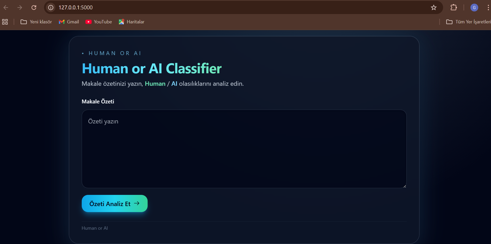
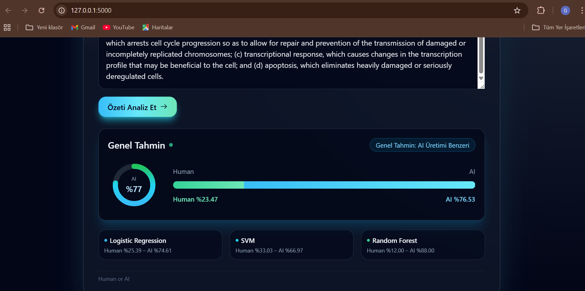

# HUMAN_OR_AI

HUMAN_OR_AI, verilen bir metnin **insan tarafından mı yoksa yapay zekâ tarafından mı üretildiğini**
makine öğrenmesi algoritmaları kullanarak tahmin eden bir web uygulamasıdır.

Bu proje, doğal dil işleme (NLP) teknikleri ve farklı sınıflandırma algoritmaları kullanılarak geliştirilmiştir.

---

## Projenin Amacı

Bu projenin amacı, günümüzde giderek yaygınlaşan yapay zekâ destekli metin üretim araçları karşısında,
insan ve yapay zekâ tarafından üretilen metinleri ayırt edebilecek bir sistem geliştirmektir.

Proje kapsamında:
- Metinler analiz edilmiştir
- Makine öğrenmesi modelleri eğitilmiştir
- Eğitilen modeller bir web arayüzü üzerinden kullanıcıya sunulmuştur

---

## Kullanılan Teknolojiler

- **Python**
- **Flask**
- **Scikit-learn**
- **Pandas**
- **TF-IDF (Text Vectorization)**
- **HTML / Jinja2**


## Proje Yapısı

### Klasör Açıklamaları

- **data/**  
  Yapay zekâ ve insan tarafından üretilmiş metinlerin bulunduğu veri setlerini içerir.

- **models/**  
  Eğitilen makine öğrenmesi modelleri ve TF-IDF vektörleştirici dosyalarını içerir.

- **templates/**  
  Flask uygulamasının web arayüzünü oluşturan HTML dosyalarını içerir.

- **train_models.py**  
  Veri setlerini kullanarak makine öğrenmesi modellerini eğiten Python dosyasıdır.

- **app.py**  
  Eğitilen modelleri yükleyerek kullanıcıdan alınan metin üzerinde tahmin yapan Flask uygulamasıdır.

- **requirements.txt**  
  Projenin çalışması için gerekli olan Python kütüphanelerini listeler.


## Kurulum ve Çalıştırma

### 1. Projeyi Klonlayın
```bash
git clone https://github.com/Sude2012/Human_or_AI.git
cd Human_or_AI

### 2. Virtual Environment Oluşturun ve Aktif Edin
python -m venv venv
venv\Scripts\activate

### 3. Gerekli Paketleri Yükleyin
pip install -r requirements.txt

### 4. (Opsiyonel) Modelleri Eğitin
python train_models.py

### 5. Uygulamayı Çalıştırın
python app.py

### Tarayıcıdan açın
http://127.0.0.1:5000/


---


## Model ve Çalışma Mantığı

Bu projede, metin sınıflandırma problemi için farklı makine öğrenmesi algoritmaları kullanılmıştır.

Kullanılan modeller:
- Logistic Regression
- Support Vector Machine (SVM)
- Random Forest

Metin verileri, makine öğrenmesi modellerine girdi olarak verilebilmesi için
**TF-IDF (Term Frequency – Inverse Document Frequency)** yöntemi ile sayısal vektörlere dönüştürülmüştür.

Eğitilen modeller `.pkl` formatında kaydedilmiş ve Flask uygulaması tarafından
yüklenerek gerçek zamanlı tahminlerde kullanılmıştır.


## Ekran Görüntüleri

### Ana Sayfa



### Tahmin Sonucu




